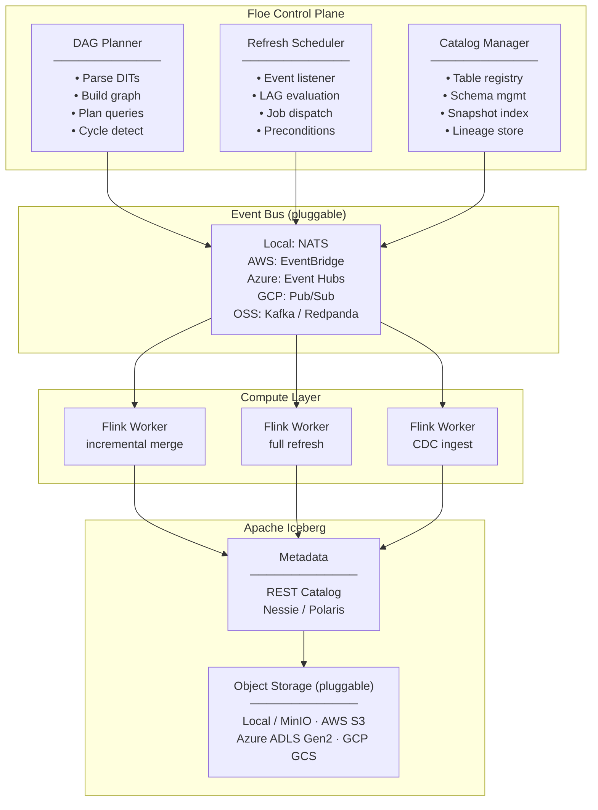

# Floe

**The cloud-agnostic, event-driven declarative lakehouse engine built on Apache Iceberg.**

> *"Don't build the engine. Delete the engine."*

Floe brings Snowflake-style Dynamic Tables to Apache Iceberg — without cloud lock-in. Declare your transformations in SQL; Floe automatically builds the dependency DAG, propagates changes incrementally when upstream data changes, and handles data quality routing — all without a custom orchestration service.

```sql
CREATE DYNAMIC TABLE silver.orders
  LAG = '5 minutes'
  REFRESH_MODE = INCREMENTAL
  PRECONDITIONS (
    min_rows(bronze.raw_orders, count=1)
  )
  ON_DQ_FAIL ROUTE TO quarantine.orders_failed
  AS
  SELECT o.order_id, o.amount, c.region
  FROM bronze.raw_orders o
  JOIN bronze.customers c ON o.customer_id = c.id;
```

**Key properties:**

- **Declarative** — define *what* you want, not *how* to refresh it
- **Event-driven** — pipelines fire on Iceberg commit events, not cron schedules
- **Iceberg-native** — pure open table format; works with any Iceberg-compatible reader (Trino, DuckDB, Spark)
- **Cloud-agnostic** — runs identically on AWS, Azure, GCP, or a laptop
- **Stateless workers** — all state lives in Iceberg snapshots; no external state stores
- **Data as State** — the data itself is the source of truth; no external state stores
- **Built-in DQ** — preconditions, quarantine routing, and automatic lineage injection on every write

> **Status:** Early design phase.

---

## Table of Contents

1. [Problem Statement](#1-problem-statement)
2. [Inspiration: Snowflake's Architecture](#2-inspiration-snowflakes-architecture)
3. [Core Concepts](#3-core-concepts)
4. [Architecture Overview](#4-architecture-overview)
5. [Component Deep Dives](#5-component-deep-dives)
6. [Developer Interface](#6-developer-interface)
7. [Deployment Modes](#7-deployment-modes)
8. [Operational Patterns](#8-operational-patterns)
9. [Comparison with Existing Projects](#9-comparison-with-existing-projects)
10. [Roadmap](#10-roadmap)
11. [Open Questions](#11-open-questions)

---

## 1. Problem Statement

### 1.1 The Custom Orchestration Trap

Most data teams eventually build a custom orchestration layer: a service that polls sources, tracks what has been processed, resolves dependencies, and triggers downstream jobs. This pattern consistently fails at scale for the same reasons:

- Dependency logic becomes hardcoded into a stateful service
- State is stored externally (DynamoDB, Redis, S3 path conventions) and drifts from reality
- The service becomes a single point of failure for all pipelines
- Operational burden grows linearly with the number of pipelines
- Local testing is impossible without replicating the full orchestration environment

The trap is not a bad engineer — it is the absence of a platform that makes the right pattern the easy pattern.

### 1.2 The Gap in the Open-Source Ecosystem

The streaming lakehouse ecosystem is maturing rapidly, but a clear gap remains:

| Project | Event-Driven | Iceberg-Native | Dynamic Table DAG | Cloud-Agnostic | Local Mode |
|---------|:---:|:---:|:---:|:---:|:---:|
| Apache Paimon | ✅ | ❌ (own format) | ❌ | ✅ | Partial |
| RisingWave | ✅ | Partial | ✅ | ✅ | ✅ |
| Flink + Iceberg (DIY) | ✅ | ✅ | ❌ | ✅ | ❌ |
| Delta Live Tables | ✅ | ❌ | ✅ | ❌ (Databricks only) | ❌ |
| Snowflake Dynamic Tables | ✅ | ❌ | ✅ | ❌ (Snowflake only) | ❌ |
| **Floe** | ✅ | ✅ | ✅ | ✅ | ✅ |

No existing open-source project combines all five. Floe fills this gap.

### 1.3 What Floe Is Not

- **Not a query engine.** Floe does not serve interactive SQL queries. Use Trino, DuckDB, or Spark SQL to read Floe-managed Iceberg tables.
- **Not a data catalog UI.** Use Apache Polaris, Project Nessie, or your cloud provider's catalog.
- **Not a replacement for Kafka/Flink.** Floe is a coordination and declaration layer that orchestrates Flink jobs. It does not replace the underlying compute.

---

## 2. Inspiration: Snowflake's Architecture

Floe is a direct implementation of the patterns described in Snowflake's research papers: *"Streaming Democratized"* and *"What's the Difference?"*

### 2.1 Immutable Versioned Storage

Snowflake never modifies a file in place. Every write produces a new table version defined by the set of micro-partitions active at that timestamp. Apache Iceberg replicates this exactly:

- Every commit creates a new **Snapshot ID**
- Snapshots are immutable; old snapshots enable time travel
- Incremental scans read only the files added between two snapshot IDs: `read.option("start-snapshot-id", X)`

This makes Iceberg the correct storage foundation for Floe — not Delta Lake (which has a different metadata model) and not a proprietary format.

### 2.2 Query Differentiation

Snowflake treats streaming as a **mathematical problem**, not a data movement problem. Instead of re-running the full query `Q` on every refresh, the Snowflake compiler rewrites it into its derivative `ΔQ` — a query that operates only on the rows that changed since the last checkpoint.

Algebraic rules apply:
- `Δ(A JOIN B)` → scan only new rows in A joined against full B (or vice versa)
- `Δ(GROUP BY)` → merge new aggregates into existing aggregates
- `Δ(FILTER)` → apply filter to new rows only

Compute cost scales with **change volume**, not **total data volume**.

Floe implements this via Flink's incremental processing model, generating merge plans that operate on Iceberg snapshot diffs rather than full table scans.

### 2.3 Dynamic Tables

Snowflake's Dynamic Tables abstract away scheduling entirely:

1. User declares the desired output (SQL query) and desired freshness (`TARGET_LAG`)
2. The system builds a DAG of dependencies
3. The scheduler monitors upstream freshness and triggers refreshes only when needed

Floe's **Dynamic Iceberg Tables (DITs)** are the open-source equivalent, extended with explicit data quality preconditions and quarantine routing.

---

## 3. Core Concepts

### 3.1 Dynamic Iceberg Table (DIT)

The central abstraction. A DIT is an Iceberg table defined by a query over other Iceberg tables or streaming sources. It has:

- A **query** (the desired output)
- A **lag target** (desired freshness)
- A **refresh mode** (how to compute the update)
- Optional **preconditions** (data readiness checks before processing)
- Optional **DQ routing** (what to do with rows that fail quality checks)

```sql
CREATE DYNAMIC TABLE silver.orders
  LAG = '5 minutes'
  REFRESH_MODE = INCREMENTAL
  PRECONDITIONS (
    min_rows(bronze.raw_orders, count=1)
  )
  ON_DQ_FAIL ROUTE TO quarantine.orders_failed
  AS
  SELECT
    o.order_id,
    o.amount,
    c.region,
    c.segment
  FROM bronze.raw_orders o
  JOIN bronze.customers c ON o.customer_id = c.id;
```

### 3.2 Refresh Modes

| Mode | Description | When to Use |
|------|-------------|-------------|
| `INCREMENTAL` | Reads only the Iceberg snapshot diff; merges into output table | Default; works for most joins, filters, simple aggregations |
| `FULL` | Full recompute from scratch | Complex aggregations where incremental rewrite is not possible |
| `TRIGGERED` | Fires immediately on any upstream commit event | Sub-minute latency requirements |
| `SCHEDULED` | Time-based (cron expression), ignores commit events | External data sources without Iceberg commits |

Floe automatically degrades to `FULL` if the DAG Planner determines `INCREMENTAL` is not safe for the given query.

### 3.3 The Precondition (Sensor Pattern)

A precondition is a data readiness assertion that must pass before a refresh executes. If a precondition fails, the refresh exits cleanly (no error, no partial write) and retries on the next event.

Built-in precondition functions:

| Function | Description |
|----------|-------------|
| `min_rows(table, count=N)` | Table must have at least N rows |
| `completeness(table, partition_col, distinct_vals=N)` | Partition column must have N distinct values (e.g., 7 days in a week) |
| `snapshot_age(table, max_age='1 hour')` | Upstream snapshot must be fresher than threshold |
| `dependency_ready(table_a, table_b)` | Both upstream tables must share the same processing epoch |
| Custom Python function | Any callable returning `bool` |

Example — wait for a full week before computing weekly scorecard:

```sql
CREATE DYNAMIC TABLE gold.weekly_scorecard
  LAG = '1 day'
  REFRESH_MODE = INCREMENTAL
  PRECONDITIONS (
    completeness(silver.events, partition_col='day', distinct_vals=7, filter="week = current_week()")
  )
  AS
  SELECT week, da_id, sum(score) as total_score
  FROM silver.events
  GROUP BY week, da_id;
```

### 3.4 Data Quality Routing (Quarantine Pattern)

Rather than crashing on bad data or silently dropping rows, Floe routes DQ-failed rows to a companion quarantine table. The production table only receives rows that pass all DQ checks.

```sql
CREATE DYNAMIC TABLE silver.payments
  LAG = '10 minutes'
  ON_DQ_FAIL ROUTE TO quarantine.payments_failed
  DQ_RULES (
    not_null(payment_id),
    not_null(amount),
    range_check(amount, min=0.01, max=100000),
    no_duplicates(payment_id)
  )
  AS SELECT * FROM bronze.raw_payments;
```

The quarantine table is a regular Iceberg table with an additional `_floe_dq_failure_reason` column. An alert fires if the quarantine write rate exceeds a configured threshold.

### 3.5 Automatic Snapshot Lineage

Every DIT write automatically injects lineage metadata columns. These are non-optional — they are how Floe guarantees auditability for payment-impacting and compliance-sensitive data.

| Column | Description |
|--------|-------------|
| `_floe_input_snapshot_id` | Snapshot ID of the upstream table read during this refresh |
| `_floe_job_run_id` | Unique ID for this specific refresh execution |
| `_floe_processed_at` | UTC timestamp of when this row was written |
| `_floe_refresh_mode` | `INCREMENTAL` or `FULL` — which mode was used |

This enables exact audit queries: *"Show me the exact upstream state that produced payment record X."*

```sql
SELECT _floe_input_snapshot_id
FROM silver.payments
WHERE payment_id = 'pay_abc123';
-- Returns: 8029341234
-- Now time-travel to that snapshot:
SELECT * FROM bronze.raw_payments
FOR VERSION AS OF 8029341234
WHERE payment_id = 'pay_abc123';
```

### 3.6 The DAG

Floe parses all DIT definitions in a project and builds a directed acyclic graph of table dependencies. This DAG drives:

- **Cascade scheduling** — when Table A commits, Floe knows which downstream DITs (B, C, D...) need to be evaluated
- **Parallel refresh** — independent branches of the DAG refresh concurrently
- **Cycle detection** — circular dependencies are rejected at `floe apply` time
- **Schema change propagation** — upstream schema changes are detected before a refresh runs, not during

---

## 4. Architecture Overview



### Refresh Event Flow

```
1.  Source write → Iceberg table (CDC via Flink, direct write, or streaming ingest)
2.  Iceberg commit → emits CommitEvent { table, snapshot_id, timestamp }
3.  Event Bus delivers CommitEvent to Refresh Scheduler
4.  Refresh Scheduler checks: which downstream DITs depend on this table?
5.  For each dependent DIT:
      a. Evaluate LAG: is a refresh due?
      b. Run PRECONDITIONS: does the data meet readiness criteria?
      c. If both pass → submit Flink job with incremental merge plan
6.  Flink job reads Iceberg snapshot diff, applies transformation, writes new snapshot
7.  New Iceberg commit on downstream table → emit CommitEvent → repeat from step 3
```

---

## 5. Component Deep Dives

### 5.1 DAG Planner

The DAG Planner is responsible for parsing DIT definitions and building the dependency graph.

**Inputs:** DIT SQL/Python definitions, existing Iceberg catalog state
**Outputs:** Execution plan per DIT (query rewrite, refresh mode, incremental merge strategy)

Key responsibilities:

- **SQL parsing** — extract table references from `AS SELECT ...` to build edges
- **Incremental eligibility** — determine if a query can be run incrementally or requires full recompute. Rules:
  - Simple projections and filters: `INCREMENTAL`
  - Joins where one side is append-only: `INCREMENTAL`
  - Aggregations with `GROUP BY`: `INCREMENTAL` (using partial aggregation merge)
  - Window functions with unbounded windows: `FULL`
  - Self-joins: `FULL`
- **Query rewrite** — generate the `ΔQ` (delta query) for incremental mode, using Iceberg's snapshot diff API
- **Schema validation** — detect upstream schema changes before runtime

### 5.2 Refresh Scheduler

The Refresh Scheduler is the heart of the event-driven loop. It is a lightweight, stateless process — its only persistent state is the last-processed snapshot ID per DIT, stored as Iceberg table properties.

**Responsibilities:**
- Subscribe to the Event Bus for `CommitEvent` messages
- Maintain the per-DIT refresh timer (LAG evaluation)
- Evaluate preconditions before dispatching a Flink job
- Prevent duplicate dispatches (idempotency guard using snapshot ID)
- Handle backpressure: if a DIT's Flink job is still running, queue (do not drop) the next trigger

**Idempotency:** Before dispatching a job, the Scheduler checks: *"Has this specific upstream snapshot already been processed for this DIT?"* If yes, skip. The checkpoint is written to the output Iceberg table's properties — no external state store required.

### 5.3 Catalog Manager

Wraps the Iceberg catalog to provide Floe-specific operations:

- Table registration and discovery
- Schema evolution coordination (schema changes require DAG re-validation)
- Snapshot indexing for incremental scan planning
- Lineage metadata storage (DIT → upstream snapshot mapping)

**Supported catalogs:**
- Iceberg REST Catalog (default)
- Project Nessie (Git-like branching for Iceberg tables)
- Apache Polaris (cloud-managed)
- AWS Glue Data Catalog
- Hive Metastore

### 5.4 Event Bus (Pluggable)

The Event Bus is the signal backbone. It carries `CommitEvent` messages from Iceberg writes to the Refresh Scheduler, and CDC events from source systems to ingestion workers.

| Deployment | Event Bus | Notes |
|------------|-----------|-------|
| Local | Embedded NATS JetStream | Zero external dependencies |
| AWS | Amazon EventBridge | Native Iceberg S3 event integration |
| Azure | Azure Event Hubs | Kafka-compatible API |
| GCP | Google Cloud Pub/Sub | — |
| Self-managed | Apache Kafka / Redpanda | Works everywhere |

The Event Bus interface is a thin abstraction (`publish(event)`, `subscribe(topic, handler)`). Swapping implementations requires only a config change — no code changes to the Scheduler or workers.

### 5.5 Compute Layer (Apache Flink)

Apache Flink is the primary compute engine. It was chosen over Spark/Glue for two reasons:

1. **Native streaming** — Flink is a streaming-first engine. Spark is batch-first with streaming bolted on. For low-latency `TRIGGERED` refresh modes, Flink's architecture is the correct fit.
2. **Iceberg connector maturity** — Flink's Iceberg connector supports full read/write including streaming writes with exactly-once semantics.

Flink jobs in Floe are **short-lived and stateless**:
- Launched per refresh (not long-running streaming jobs, unless in `TRIGGERED` mode)
- State lives in Iceberg, not in Flink's state backend
- Workers are disposable — any failure simply retries from the last snapshot

For `TRIGGERED` mode (sub-minute latency), Floe runs a persistent Flink streaming job that continuously reads the Iceberg change log.

**Flink deployment options:**
- Standalone (local mode, Docker Compose)
- Kubernetes (via Flink Kubernetes Operator)
- AWS: Amazon EMR / Kinesis Data Analytics
- Azure: HDInsight / Azure Stream Analytics (Flink)
- GCP: Dataproc (Flink)

### 5.6 Storage Layer (Apache Iceberg)

Floe writes exclusively to Apache Iceberg tables. No proprietary format, no vendor lock-in.

**Why Iceberg (not Delta Lake, not Hudi, not Paimon):**

| Feature | Iceberg | Delta Lake | Hudi | Paimon |
|---------|:-------:|:----------:|:----:|:------:|
| Open spec (no single vendor) | ✅ | Partial (Databricks) | ✅ | ✅ |
| Snapshot-based versioning | ✅ | ✅ | Partial | ✅ |
| Incremental scan API | ✅ (`start-snapshot-id`) | Limited | ✅ | ✅ |
| REST Catalog standard | ✅ | ❌ | ❌ | ❌ |
| Multi-engine read support | ✅ | ✅ | Partial | Partial |
| Schema evolution (safe) | ✅ | Partial | Partial | ✅ |

Iceberg's `start-snapshot-id` / `end-snapshot-id` scan option is what makes Floe's incremental refresh mathematically exact. It is the direct equivalent of Snowflake's micro-partition diff.

---

## 6. Developer Interface

### 6.1 Project Structure

```
my-pipeline/
├── floe.yaml              # project config (catalog, compute, storage)
├── sources/
│   └── raw_orders.sql     # source table definitions
├── transformations/
│   ├── silver_orders.sql  # DIT definitions
│   └── gold_metrics.sql
├── dq/
│   └── rules.py           # custom DQ rule functions
└── tests/
    └── test_silver_orders.py
```

### 6.2 Configuration: `floe.yaml`

```yaml
project: my-analytics-pipeline
version: "1.0"

catalog:
  type: rest                        # rest | nessie | polaris | glue | hive
  uri: http://localhost:8181

compute:
  engine: flink
  mode: local                       # local | kubernetes | emr | dataproc | hdinsight
  parallelism: 4

storage:
  type: s3compatible                # s3compatible | s3 | adls | gcs | local
  warehouse: s3://my-bucket/warehouse
  endpoint: http://localhost:9000   # MinIO for local mode

event_bus:
  type: nats                        # nats | eventbridge | eventhubs | pubsub | kafka
  uri: nats://localhost:4222

defaults:
  lag: "5 minutes"
  refresh_mode: incremental
  on_dq_fail: quarantine
  lineage: true                     # inject _floe_* columns (default: true, non-optional)
```

### 6.3 Declarative SQL DDL

Full DIT definition syntax:

```sql
CREATE DYNAMIC TABLE <catalog>.<database>.<table>
  [ LAG = '<duration>' ]
  [ REFRESH_MODE = INCREMENTAL | FULL | TRIGGERED | SCHEDULED '<cron>' ]
  [ PRECONDITIONS (
      <precondition_function>(...) [, ...]
  ) ]
  [ DQ_RULES (
      <dq_rule_function>(...) [, ...]
  ) ]
  [ ON_DQ_FAIL ROUTE TO <quarantine_table> | FAIL | DROP ]
  [ TAGS ( key = 'value' [, ...] ) ]
  AS
  <select_statement>;
```

### 6.4 Python SDK

```python
from floe import Pipeline, DynamicTable, preconditions, dq

pipeline = Pipeline.from_config("floe.yaml")

silver_orders = DynamicTable(
    name="silver.orders",
    query="""
        SELECT o.order_id, o.amount, c.region
        FROM bronze.raw_orders o
        JOIN bronze.customers c ON o.customer_id = c.id
    """,
    lag="5 minutes",
    refresh_mode="incremental",
    preconditions=[
        preconditions.min_rows("bronze.raw_orders", count=1),
    ],
    dq_rules=[
        dq.not_null("order_id"),
        dq.range_check("amount", min=0.01),
    ],
    on_dq_fail="quarantine",
)

pipeline.register(silver_orders)
pipeline.apply()
```

Custom precondition:

```python
from floe.preconditions import precondition

@precondition
def weekly_completeness(spark, table: str, week: str) -> bool:
    count = spark.read.format("iceberg").load(table) \
        .filter(f"week = '{week}'") \
        .select("day").distinct().count()
    return count >= 7
```

### 6.5 CLI

```bash
floe init my-pipeline                               # scaffold project
floe plan                                           # validate DITs, show DAG
floe apply                                          # deploy DIT definitions
floe status                                         # DAG status and refresh health
floe dag                                            # visualize dependency graph
floe refresh silver.orders                          # manual trigger
floe deploy --shadow silver.orders                  # deploy in shadow mode
floe promote silver.orders                          # promote shadow to production
floe diff                                           # show pending changes
floe reset-checkpoint silver.orders                 # trigger full backfill
floe reset-checkpoint silver.orders --from 2026-01-01
floe snapshot-history silver.orders --last 10
floe logs --follow
```

---

## 7. Deployment Modes

### 7.1 Local (Development)

Zero external dependencies. Everything runs in Docker Compose.

```yaml
# docker-compose.yaml (generated by `floe init`)
services:
  floe-control:      # Control plane (DAG Planner + Scheduler + Catalog Manager)
  flink-jobmanager:  # Flink cluster
  flink-taskmanager:
  minio:             # S3-compatible object storage
  nats:              # Event bus
  iceberg-rest:      # Iceberg REST catalog
```

```bash
floe up      # start local stack
floe apply   # deploy DITs
floe down    # tear down
```

### 7.2 Kubernetes

Helm chart for production deployment. Bring your own object storage and event bus.

```bash
helm repo add floe https://charts.floe.dev
helm install floe floe/floe -f floe-values.yaml
```

### 7.3 Cloud Quick-Start Configs

**AWS:**
```yaml
storage:   { type: s3,    bucket: my-bucket }
catalog:   { type: glue,  region: us-east-1 }
event_bus: { type: eventbridge }
compute:   { engine: flink, mode: emr }
```

**Azure:**
```yaml
storage:   { type: adls,      account: myaccount, container: warehouse }
catalog:   { type: rest,      uri: https://my-polaris.azurewebsites.net }
event_bus: { type: eventhubs, namespace: my-ns }
compute:   { engine: flink,   mode: hdinsight }
```

**GCP:**
```yaml
storage:   { type: gcs,    bucket: my-bucket }
catalog:   { type: rest,   uri: https://my-catalog.run.app }
event_bus: { type: pubsub, project: my-project }
compute:   { engine: flink, mode: dataproc }
```

---

## 8. Operational Patterns

### 8.1 Shadow Mode Migration

Shadow mode enables risk-free migration from a legacy pipeline to a Floe DIT. The new pipeline runs in parallel; production traffic is only switched after validation.

```bash
# Deploy in shadow mode — writes to silver.orders_shadow, runs daily reconciliation
floe deploy --shadow silver.orders

# After N days of zero variance:
floe promote silver.orders   # atomically swaps read pointer; legacy pipeline stops
```

Reconciliation reports: row count diff, value diff (configurable columns), latency diff.

### 8.2 Backfill

```bash
floe reset-checkpoint silver.orders --from-beginning
floe reset-checkpoint silver.orders --from 2026-01-01
floe reset-checkpoint silver.orders --from-snapshot 8029341234
```

Backfill uses the exact same code path as incremental refresh — there is no separate backfill mode or job.

### 8.3 Schema Evolution

Iceberg handles schema evolution natively (add column, rename column, widen type, reorder). Floe adds a guardrail:

- `floe diff` detects upstream schema changes before they propagate
- Breaking changes (drop column, type narrowing) block downstream DITs and alert
- Non-breaking changes (add column, widen type) auto-propagate with a catalog version bump

### 8.4 Monitoring

Floe emits structured metrics to a pluggable observability backend:

| Metric | Description |
|--------|-------------|
| `floe.refresh.latency_ms` | Time from CommitEvent to downstream snapshot commit |
| `floe.refresh.lag_seconds` | Actual lag vs. configured LAG target |
| `floe.dq.quarantine_rate` | Fraction of rows routed to quarantine |
| `floe.precondition.skips` | Number of times a precondition blocked a refresh |
| `floe.dag.depth` | Number of hops in the longest DAG path |

Supported backends: Prometheus, AWS CloudWatch, Azure Monitor, GCP Cloud Monitoring, OpenTelemetry.

---

## 9. Comparison with Existing Projects

### 9.1 vs. Snowflake Dynamic Tables

| Dimension | Snowflake Dynamic Tables | Floe |
|-----------|--------------------------|------|
| Table format | Proprietary micro-partitions | Apache Iceberg (open) |
| Cloud | Snowflake only | Any / local |
| Preconditions | `TARGET_LAG` only | Full precondition DSL |
| DQ routing | Not built-in | First-class quarantine pattern |
| Lineage | Internal (not exported) | Explicit `_floe_*` columns in Iceberg |
| Cost model | Snowflake credits | Open source; pay for your own compute |

### 9.2 vs. Apache Paimon

Paimon is the closest streaming table format with event-driven capabilities, but it uses its own storage format (LSM-tree based). Tables stored in Paimon cannot be read directly by Trino, DuckDB, or standard Iceberg readers. Floe is pure Iceberg — any Iceberg-compatible reader works.

### 9.3 vs. Delta Live Tables (Databricks)

DLT provides a very similar declarative pipeline experience but is Databricks-exclusive. Moving off Databricks means rewriting all pipelines. Floe is vendor-neutral by design.

### 9.4 vs. RisingWave

RisingWave is a streaming database that can sink to Iceberg. It handles Iceberg as an output, not as the primary storage layer. Floe treats Iceberg as the system of record — both the input and the output — which enables full time-travel and snapshot lineage across the entire pipeline.

### 9.5 vs. DIY Flink + Iceberg

Building the same system yourself requires writing Flink jobs per transformation, building a custom orchestration layer, implementing idempotency and checkpoint management, writing DQ routing logic per job, and building a DAG planner for multi-hop cascades. Floe replaces all of that boilerplate so engineers write only the transformation logic.

---

## 10. Roadmap

### v0.1 — Foundation
- [ ] Core DIT engine: DAG Planner, Refresh Scheduler, Catalog Manager
- [ ] Flink compute backend
- [ ] Local deployment (Docker Compose + MinIO + NATS + Iceberg REST)
- [ ] `INCREMENTAL` and `FULL` refresh modes
- [ ] Automatic `_floe_*` lineage column injection
- [ ] CLI: `init`, `apply`, `plan`, `status`, `refresh`

### v0.2 — Data Quality
- [ ] `PRECONDITIONS` DSL (built-in functions + custom Python)
- [ ] `DQ_RULES` DSL
- [ ] Quarantine routing (`ON_DQ_FAIL ROUTE TO`)
- [ ] DQ alerting (threshold-based quarantine rate)

### v0.3 — Cloud Deployment
- [ ] Kubernetes Helm chart
- [ ] AWS config profile (EventBridge + S3 + Glue catalog)
- [ ] Azure config profile (Event Hubs + ADLS + Polaris)
- [ ] GCP config profile (Pub/Sub + GCS)

### v0.4 — Operations
- [ ] Shadow mode (`floe deploy --shadow`, `floe promote`)
- [ ] Backfill commands (`floe reset-checkpoint`)
- [ ] Schema evolution guardrails
- [ ] Prometheus / OpenTelemetry metrics

### v0.5 — Developer Experience
- [ ] `TRIGGERED` refresh mode (persistent Flink streaming job)
- [ ] `floe dag` ASCII DAG visualization
- [ ] Python SDK (full parity with SQL DDL)
- [ ] VS Code extension (DIT syntax highlighting, DAG preview)

### v1.0 — Production Hardening
- [ ] Multi-catalog federation (query across catalogs in one DAG)
- [ ] Branch-based development (via Nessie catalog branching)
- [ ] Flink job failure recovery and retry policies
- [ ] Operational runbook and chaos testing suite

---

## 11. Open Questions

| Question | Notes |
|----------|-------|
| **Core language: Python or JVM?** | Python CLI for UX; Flink jobs are JVM. Control plane could be Python (easier contribution) or Kotlin (type-safe, JVM interop). Decision needed before v0.1. |
| **Catalog default for local mode** | REST catalog (via `iceberg-rest-image`) is simplest. Nessie adds branching but heavier. Start with REST, add Nessie in v0.4. |
| **Incremental aggregation correctness** | Partial aggregation merge (e.g., `SUM`, `COUNT`) is safe. `MEDIAN`, `DISTINCT COUNT` are not incrementally composable. Need a clear error message + automatic `FULL` fallback. |
| **Multi-hop cascade latency** | Deep DAGs (A → B → C → D) accumulate per-hop refresh latency. Need a maximum-cascade-depth config and a latency budget planner. |
| **Flink cold-start for short-lived jobs** | Flink job startup (~30s for standalone, ~2-4min for cloud-managed) limits how low `LAG` can go for non-`TRIGGERED` modes. Document this ceiling clearly. |
| **Licensing** | Apache 2.0 is the obvious choice for ecosystem compatibility (Iceberg, Flink are both Apache 2.0). |

---

## References

### Research Papers

- Zhu, R. et al. (2023). [**Streaming Democratized: How Snowflake Implements Dynamic Tables**](https://dl.acm.org/doi/epdf/10.1145/3589776). *ACM SIGMOD 2023.*
- Grover, A. et al. (2025). [**What's the Difference? Incremental Processing with Change Queries in Snowflake**](https://dl.acm.org/doi/epdf/10.1145/3722212.3724455). *ACM SIGMOD 2025.*

### Core Technologies

- [Apache Iceberg](https://iceberg.apache.org/) — open table format for huge analytic datasets
- [Apache Flink](https://flink.apache.org/) — stateful stream processing engine
- [Apache Flink × Iceberg connector](https://iceberg.apache.org/docs/latest/flink/) — Flink read/write support for Iceberg tables
- [Apache Paimon](https://paimon.apache.org/) — streaming lakehouse table format
- [Project Nessie](https://projectnessie.org/) — Git-like version control for data lakes
- [Apache Polaris](https://polaris.apache.org/) — open-source Iceberg catalog
- [NATS](https://nats.io/) — lightweight cloud-native messaging (local event bus)
- [MinIO](https://min.io/) — S3-compatible object storage (local deployment)

### Related Projects

- [RisingWave](https://risingwave.com/) — streaming database with Iceberg integration
- [Delta Live Tables](https://www.databricks.com/product/delta-live-tables) — declarative pipelines on Databricks
- [Snowflake Dynamic Tables](https://docs.snowflake.com/en/user-guide/dynamic-tables-intro) — the primary inspiration for this project

---

## License

Apache 2.0

---

*Floe is named for a sheet of floating ice — ice in motion. Small, flat, and fast.*
